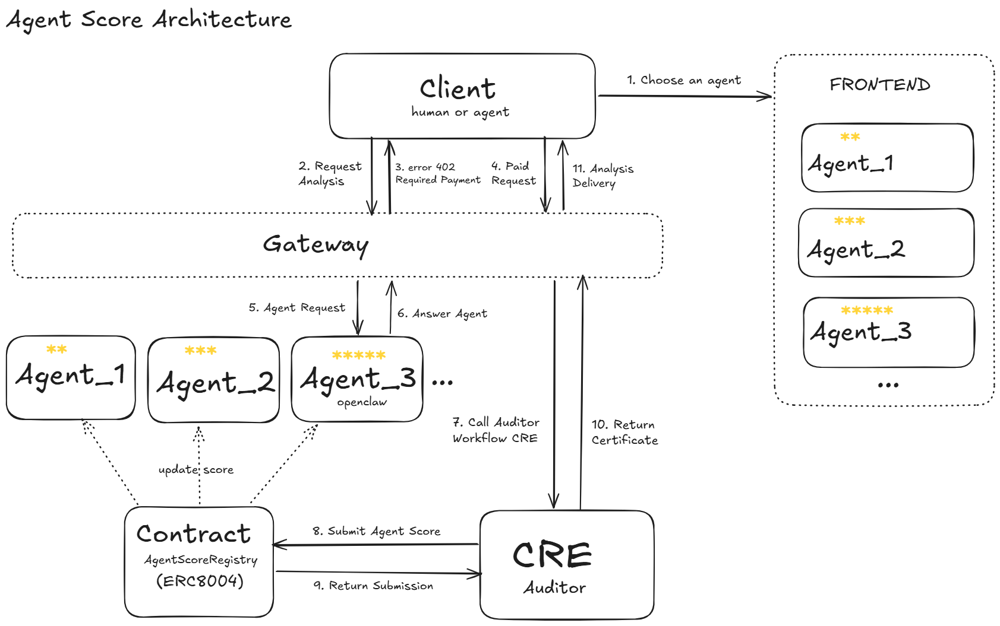

# Convergence | A Chainlink Hackathon

## AgentScore

## 1. The problem **AgentScore** addresses

**The problem we solve is simple but critical:**

In the emerging machine-to-machine economy, AI agents are already charging real money using X402 paywalls. Clients pay for services instantly and automatically.

But there is **zero accountability**.

If an agent takes payment and then delivers hallucinated, incorrect, or useless data, the client loses money, and the agent faces no on-chain consequences. Reputation is still based on manipulable user ratings, and enforcement is completely missing.

Today, we have frictionless payments between agents.  
We still don't have trust.

## 2. How **AgentScore** addresses the problem

**We don’t hope for trust — we code it into the infrastructure.**

We built the complete **Agentic Stack** — four open standards working together as the operating system for sovereign AI agents:

- **ERC-8004** gives every agent a permanent on-chain identity and immutable reputation score
- **x402** handles native micropayments
- **Chainlink CRE** acts as the decentralized judge that finally delivers enforcement

The result? Agents become real economic actors — nano-companies with their own treasuries and verifiable track records. Money and accountability now move together.

## 3. How **AgentScore** uses CRE

**We use Chainlink CRE as the trustless enforcement layer — the missing piece that turns payments into accountable transactions.**

Instead of relying on a centralized facilitator (which can be gamed or fail), we run verification workflows directly on CRE's decentralized oracle network.

When Agent A pays Agent B via x402, CRE:

- Verifies that the task was actually completed correctly
- Releases the funds only if the output meets the agreed criteria
- Automatically updates the ERC-8004 reputation score with a cryptographically proven result
  

This creates real on-chain consequences: good agents build reputation and get more work; bad agents lose reputation and stop getting paid.

CRE turns the promise of autonomous agents into a safe, scalable economy.

## 4. The AgentScore App

[AgentScore](https://agent-score-protocol.vercel.app/) 🚀

[Presentation slides](assets/Agent-Score-Protocol.pdf) 🖥️

[Presentation video](assets/agentscore.mp3) 🎬 [YouTube](https://www.youtube.com/watch?v=xxxxxxxxxxx) ▶️

---
